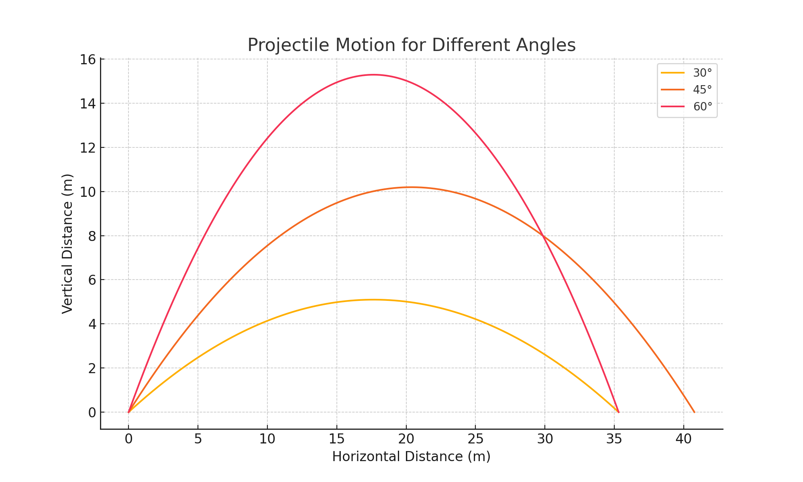
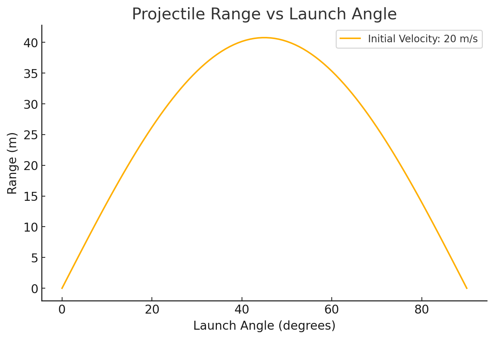

### **1. Theoretical Foundation**  
Projectile motion follows Newton's equations of motion. We start with the fundamental kinematic equations:  

\[
x = v_0 \cos(\theta) t
\]

\[
y = v_0 \sin(\theta) t - \frac{1}{2} g t^2
\]

where:  
- \( v_0 \) is the initial velocity,  
- \( \theta \) is the launch angle,  
- \( g \) is gravitational acceleration (9.81 m/s²),  
- \( t \) is time.

The **time of flight** is derived by setting \( y = 0 \):

\[
t_f = \frac{2 v_0 \sin(\theta)}{g}
\]

The **range (horizontal distance)** is:

\[
R = \frac{v_0^2 \sin(2\theta)}{g}
\]

This equation shows that:
- The maximum range is achieved at \( \theta = 45^\circ \).
- Increasing initial velocity increases the range.
- Gravitational acceleration \( g \) inversely affects the range.

### **2. Analysis of the Range**  
- **Effect of Angle**: The range is maximized at \( 45^\circ \). Below or above this angle, the range decreases.  
- **Effect of Initial Velocity**: Increasing \( v_0 \) increases the range quadratically (\( R \propto v_0^2 \)).  
- **Effect of Gravity**: A higher \( g \) (e.g., on Jupiter) reduces the range, while a lower \( g \) (e.g., on the Moon) increases it.

### **3. Practical Applications**  
- **Sports**: Optimizing launch angles in football, golf, and basketball.  
- **Military & Aerospace**: Calculating missile trajectories.  
- **Engineering**: Designing water fountains, rockets, and ballistics.

### **4. Implementation**  
A Python script was provided to:
1. **Simulate projectile motion** for different angles.
2. **Plot range vs angle** for analysis.
3. **Visualize trajectories** with different parameters.

### **Limitations & Future Enhancements**  
- **No Air Resistance**: In reality, air drag reduces the range.  
- **Uneven Terrain**: The model assumes a flat surface.  
- **Variable Gravity**: Not applicable in different planetary conditions.  

To improve the model:
- Add **air resistance** using drag force \( F_d = \frac{1}{2} C_d \rho A v^2 \).
- Model **wind effects** using horizontal forces.
- Consider **non-uniform gravity** in planetary motion.