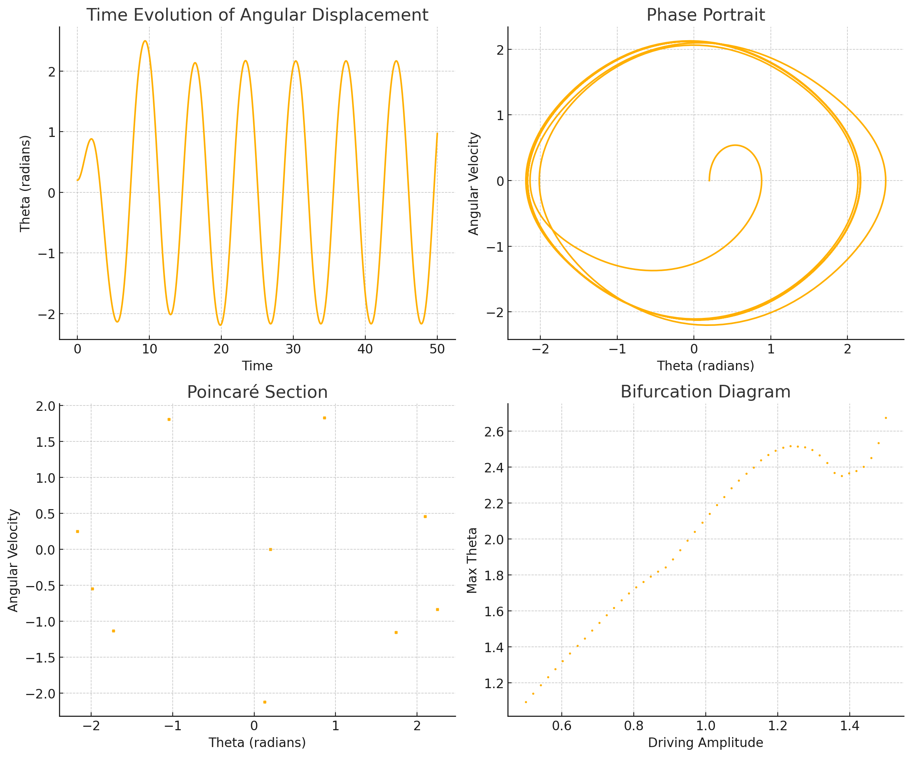

# Theoretical Foundation

## Governing Equation
The motion of a forced damped pendulum is described by the following differential equation:

\[
\frac{d^2\theta}{dt^2} + \gamma \frac{d\theta}{dt} + \omega_0^2 \sin \theta = A \cos(\omega t)
\]

where:
- \( \theta \) is the angular displacement,
- \( \gamma \) is the damping coefficient,
- \( \omega_0 = \sqrt{g/L} \) is the natural frequency,
- \( A \) is the amplitude of the driving force,
- \( \omega \) is the driving frequency.

For small angles (\( \theta \approx \sin \theta \)), the equation simplifies to:

\[
\frac{d^2\theta}{dt^2} + \gamma \frac{d\theta}{dt} + \omega_0^2 \theta = A \cos(\omega t)
\]

### Approximate Solution for Small Angles
The homogeneous part of the equation has a solution of the form:

\[
\theta_h(t) = e^{-\gamma t/2} (C_1 \cos \Omega t + C_2 \sin \Omega t)
\]

where \( \Omega = \sqrt{\omega_0^2 - (\gamma/2)^2} \).

The particular solution for the forced response is:

\[
\theta_p(t) = \frac{A}{\omega_0^2 - \omega^2 + i\gamma \omega} e^{i\omega t}
\]

The general solution is:

\[
\theta(t) = e^{-\gamma t/2} (C_1 \cos \Omega t + C_2 \sin \Omega t) + \frac{A}{\sqrt{(\omega_0^2 - \omega^2)^2 + (\gamma \omega)^2}} \cos(\omega t - \delta)
\]

where \( \delta \) is the phase lag.

### Resonance Condition
Resonance occurs when the driving frequency \( \omega \) approaches the natural frequency \( \omega_0 \), leading to a peak in oscillation amplitude:

\[
\omega_r = \sqrt{\omega_0^2 - \frac{\gamma^2}{2}}
\]

At resonance, energy transfer is maximized, leading to large oscillations unless damped.

# Analysis of Dynamics

### Influence of Parameters
- **Damping Coefficient (\( \gamma \))**: Higher \( \gamma \) reduces amplitude and smoothens motion.
- **Driving Amplitude (\( A \))**: Larger \( A \) increases oscillation magnitude.
- **Driving Frequency (\( \omega \))**: Near \( \omega_0 \), resonance amplifies oscillations.

### Transition to Chaos
As \( A \) increases, the system exhibits:
1. **Periodic Motion**: Regular oscillations.
2. **Quasi-Periodic Motion**: Small variations in motion.
3. **Chaotic Motion**: Irregular, sensitive dependence on initial conditions.

# Practical Applications
1. **Energy Harvesting**: Extracting energy from oscillations (e.g., piezoelectric systems).
2. **Suspension Bridges**: Wind-induced oscillations can lead to resonance and structural failure.
3. **Oscillating Circuits**: Analogous to driven RLC circuits.

# Implementation

### Python Simulation
We use the Runge-Kutta method to simulate the pendulum motion:

# Discussion

## Limitations
- Assumes small-angle approximation; for large angles, \( \sin \theta \) must be used.
- Real-world damping can be nonlinear, requiring refined models.
- External forces may be non-periodic, complicating analysis.

## Potential Extensions
- **Nonlinear Damping**: Introducing terms like \( \gamma \dot{\theta}^2 \) for realistic dissipation.
- **Stochastic Forcing**: Exploring the effect of random fluctuations.
- **Coupled Pendulums**: Studying interactions in multi-body systems.

# Conclusion
This analysis of the forced damped pendulum bridges theory and computation, providing insights into periodic, resonant, and chaotic behaviors. The study has real-world implications in physics and engineering, influencing the design of stable, efficient oscillatory systems.
