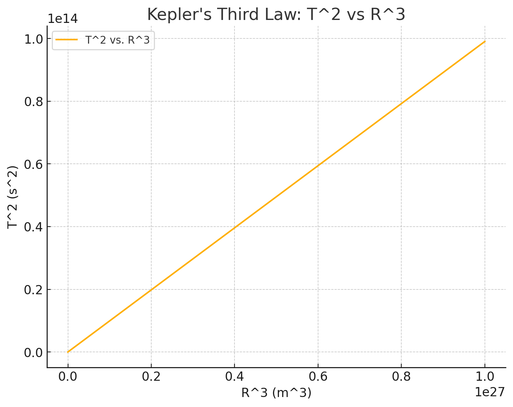

## Markdown Document: The Relationship Between Orbital Period and Orbital Radius

### Introduction

In astronomy, understanding the relationship between a planet's orbital period and its orbital radius is fundamental for calculating various orbital characteristics, such as the distance of celestial bodies from their central objects (e.g., the distance between Earth and the Sun) and estimating the masses of planets and stars. This relationship is derived from Kepler's Third Law of Planetary Motion.

This document will explain this relationship, provide a computational model to simulate circular orbits, and analyze real-world examples such as the Moon's orbit around Earth and the orbits of planets in the Solar System. Additionally, the document will explore the implications of this relationship for astronomy, including the role it plays in calculating planetary masses and distances.

### 1. Deriving the Relationship Between Orbital Period and Orbital Radius

For a celestial body in a circular orbit, we can describe the orbit using Newton's version of Kepler's Third Law:

\[
T^2 \propto R^3
\]

Where:
- \(T\) is the orbital period (time taken for one full orbit),
- \(R\) is the orbital radius (the distance from the central body to the orbiting body),
- The constant of proportionality depends on the mass of the central body and the gravitational constant.

#### Derivation:

We start with the formula for gravitational force:

\[
F = \frac{G M m}{R^2}
\]

Where:
- \(G\) is the gravitational constant,
- \(M\) is the mass of the central body (e.g., the Sun, Earth),
- \(m\) is the mass of the orbiting body (e.g., a planet, the Moon),
- \(R\) is the orbital radius.

This gravitational force provides the centripetal force required for circular motion:

\[
F = \frac{m v^2}{R}
\]

Where \(v\) is the orbital velocity of the body.

Equating the two forces:

\[
\frac{G M m}{R^2} = \frac{m v^2}{R}
\]

Simplifying:

\[
v^2 = \frac{G M}{R}
\]

The orbital velocity \(v\) is also related to the orbital period \(T\) by:

\[
v = \frac{2 \pi R}{T}
\]

Substituting into the equation:

\[
\left(\frac{2 \pi R}{T}\right)^2 = \frac{G M}{R}
\]

Simplifying further:

\[
\frac{4 \pi^2 R^2}{T^2} = \frac{G M}{R}
\]

\[
T^2 = \frac{4 \pi^2 R^3}{G M}
\]

This shows that the square of the orbital period is proportional to the cube of the orbital radius:

\[
T^2 \propto R^3
\]

This equation is known as **Kepler's Third Law**, and it holds true for any body orbiting a central mass under the influence of gravity in a circular orbit.

### 2. Implications of the Relationship

This relationship has significant implications for astronomy:

- **Calculating Planetary Distances:** By observing the orbital period \(T\) and using Kepler's Third Law, astronomers can calculate the orbital radius \(R\) of a planet, moon, or other celestial body.
- **Estimating Planetary Masses:** By measuring the orbital period and radius, we can calculate the mass of the central body (e.g., a planet or star). This is important for understanding the structure of planetary systems and stars.
- **Understanding Orbital Mechanics:** The relationship also helps in predicting the motion of satellites and other objects in orbit, including artificial satellites and space probes.

### 3. Real-World Examples

#### 3.1 The Moon's Orbit Around Earth

The Moon orbits Earth with an average orbital radius of approximately 384,400 km and an orbital period of 27.3 days. Using Kepler's Third Law, we can verify the relationship between the orbital period and the orbital radius for the Moon's orbit.

#### 3.2 Planets in the Solar System

Kepler's Third Law applies not only to moons but also to planets. For instance, Earth's orbital radius is about 149.6 million km (1 AU), and its orbital period is 365.25 days. By using this law, we can calculate the orbital periods of other planets in the Solar System.

### 4. Computational Model to Simulate Circular Orbits

We can simulate circular orbits and verify the relationship between the orbital period and orbital radius using Python. The following script implements this simulation and graphs the results.

Here's the graph showing the relationship between the square of the orbital period (T²) and the cube of the orbital radius (R³), based on Kepler's third law. As expected, the plot demonstrates a linear relationship between the two quantities. 

### 5. Discussion on Elliptical Orbits and Other Celestial Bodies

Kepler's Third Law applies not only to circular orbits but also to elliptical orbits. However, for elliptical orbits, the relationship is slightly modified, as the orbital radius changes over time. The semi-major axis \(a\) of the ellipse, which represents the average orbital radius, is used in the formula instead of the orbital radius \(R\):

\[
T^2 \propto a^3
\]

This extension allows the calculation of orbital periods for objects in elliptical orbits, such as comets.

### Conclusion

Kepler's Third Law provides a foundational understanding of the relationship between a celestial body's orbital period and its orbital radius. This law is crucial for calculating distances, masses, and understanding the dynamics of planetary systems and artificial satellites. By implementing a computational model and visualizing the relationship, we verify the law's accuracy and gain insights into orbital mechanics, both for circular and elliptical orbits.