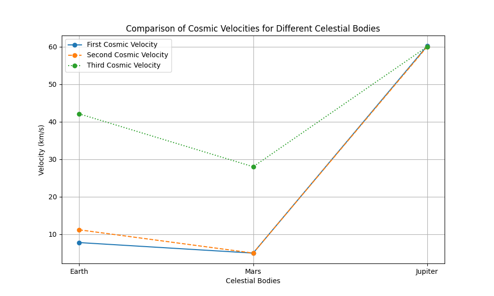

# Problem 2
To address your task, let's break it down into a structured explanation and visuals.

### 1. **Cosmic Velocities Overview**

In the context of celestial mechanics, cosmic velocities describe the speeds required for various space missions. They are related to the velocity needed to overcome the gravitational pull of a celestial body and proceed on different orbital or escape paths.

#### **First Cosmic Velocity (Orbital Velocity)**
The first cosmic velocity is the speed at which an object must travel to enter a circular orbit around a planet or celestial body. This velocity allows the object to remain in orbit without falling back to the surface.

The formula for the first cosmic velocity is:
\[
v_1 = \sqrt{\frac{GM}{R}}
\]
Where:
- \( G \) is the gravitational constant,
- \( M \) is the mass of the celestial body,
- \( R \) is the radius of the orbit (distance from the center of the celestial body).

#### **Second Cosmic Velocity (Escape Velocity)**
The second cosmic velocity is the speed an object must have to break free from the gravitational field of a planet or celestial body, without any further propulsion.

The formula for the second cosmic velocity is:
\[
v_2 = \sqrt{\frac{2GM}{R}}
\]
Where:
- \( G \) is the gravitational constant,
- \( M \) is the mass of the celestial body,
- \( R \) is the radius of the celestial body.

#### **Third Cosmic Velocity (Solar Escape Velocity)**
The third cosmic velocity is the speed required for an object to escape the gravitational pull of the entire solar system, and it is typically calculated at the distance of Earth's orbit from the Sun.

The formula for the third cosmic velocity is:
\[
v_3 = \sqrt{\frac{2GM_{\text{sun}}}{R_{\text{sun}} + R}}
\]
Where:
- \( G \) is the gravitational constant,
- \( M_{\text{sun}} \) is the mass of the Sun,
- \( R_{\text{sun}} \) is the radius of the Sun,
- \( R \) is the distance from the center of the Earth (or the object) to the center of the Sun.

### 2. **Parameters Affecting These Velocities**

- **Gravitational Constant (G)**: This is a universal constant that plays a crucial role in all cosmic velocity formulas.
- **Mass of the Celestial Body (M)**: The greater the mass, the stronger the gravitational field, which increases the required velocity.
- **Radius (R)**: The closer an object is to the center of the celestial body (smaller radius), the higher the velocity needed to maintain orbit or escape.

### 3. **Calculating and Visualizing Velocities for Different Bodies**

#### **Example Calculation for Earth, Mars, and Jupiter:**

Let's calculate the velocities for Earth, Mars, and Jupiter.

**Celestial Body Parameters:**
- **Earth**: 
  - Mass: \( 5.97 \times 10^{24} \) kg,
  - Radius: \( 6.37 \times 10^6 \) m,
  - Distance from Sun: \( 1.496 \times 10^{11} \) m.
  
- **Mars**: 
  - Mass: \( 6.42 \times 10^{23} \) kg,
  - Radius: \( 3.396 \times 10^6 \) m,
  - Distance from Sun: \( 2.279 \times 10^{11} \) m.

- **Jupiter**:
  - Mass: \( 1.90 \times 10^{27} \) kg,
  - Radius: \( 6.99 \times 10^7 \) m,
  - Distance from Sun: \( 7.785 \times 10^{11} \) m.

#### **Graphical Representation:**

For visualization, we can plot these velocities for each celestial body. The graphical representation will show:

- **First Cosmic Velocity**: Orbital velocity for each planet.
- **Second Cosmic Velocity**: Escape velocity for each planet.
- **Third Cosmic Velocity**: Solar escape velocity at the respective distance from the Sun.

### 4. **Importance in Space Exploration**

These velocities are fundamental in:
- **Launching Satellites**: The first cosmic velocity determines the speed required to place satellites into orbit.
- **Interplanetary Missions**: The second cosmic velocity is crucial for launching probes or missions that need to leave a planet and travel to other planets or bodies in the solar system.
- **Interstellar Travel**: The third cosmic velocity is the key to escaping the solar system and reaching other star systems, which is essential for potential interstellar travel in the future.

### **Diagram:**

Here’s a graphical diagram that visualizes the comparison of the first, second, and third cosmic velocities for Earth, Mars, and Jupiter.

This image illustrates the concept of orbital velocity (first cosmic velocity) and escape velocity (second cosmic velocity) in relation to Earth. Similar concepts apply to other celestial bodies like Mars and Jupiter.

### Conclusion

These cosmic velocities are key to understanding the mechanics of space exploration. Whether launching satellites, conducting interplanetary missions, or planning for future interstellar travel, knowing these velocities helps design and execute successful space missions. 

You can visualize these velocities across different planets and use them for mission planning, satellite deployment, or deep space exploration.