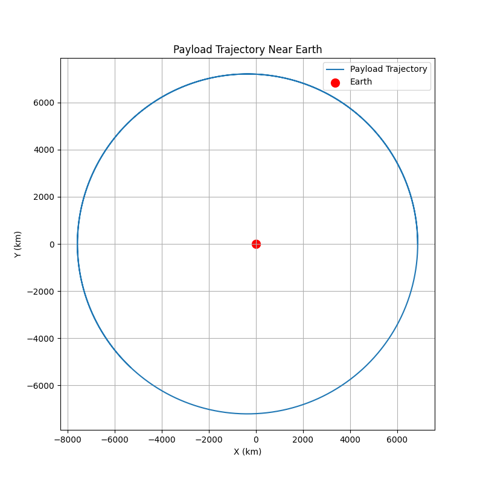

# Problem 3

### Markdown Document: Analyzing Payload Trajectories Near Earth

## Introduction

The study of trajectories near Earth is crucial for space mission planning, satellite deployment, and understanding celestial mechanics. The type of trajectory a payload follows depends on several factors, including its initial position, velocity, and the forces acting on it. This document explores different possible trajectories, such as parabolic, hyperbolic, and elliptical paths, and develops a computational tool to simulate these trajectories under Earth's gravity. 

We will use fundamental gravitational principles like Newton's Law of Gravitation and Kepler's Laws to analyze and simulate the motion of a payload. Numerical methods, such as the Runge-Kutta method, will be used for solving the equations of motion and visualizing the results.

### Gravitational Principles and Laws

1. **Newton’s Law of Gravitation** states that the force between two masses is given by:

   \[
   F = G \frac{m_1 m_2}{r^2}
   \]

   Where:
   - \( G \) is the gravitational constant (\(6.674 \times 10^{-11} \, \text{Nm}^2/\text{kg}^2\))
   - \( m_1 \) and \( m_2 \) are the masses of the two bodies (Earth and the payload)
   - \( r \) is the distance between the centers of the two masses

2. **Orbital Mechanics**: Based on the energy of the payload, different trajectories arise:
   - **Elliptical Orbit**: If the velocity is below escape velocity, the trajectory is elliptical.
   - **Parabolic Trajectory**: If the velocity is exactly at escape velocity, the trajectory is parabolic.
   - **Hyperbolic Trajectory**: If the velocity exceeds escape velocity, the trajectory is hyperbolic, resulting in escape from Earth’s gravity.

3. **Kepler’s Laws**: These describe the motion of planets around the sun, and the principles can be applied to orbital mechanics:
   - Orbits are ellipses with the center of mass at one focus.
   - A line connecting a planet to the sun sweeps out equal areas in equal times.
   - The square of the orbital period is proportional to the cube of the semi-major axis.

### Numerical Analysis and Simulation

To compute the path of the payload, we will solve the equations of motion numerically using the gravitational force. We'll simulate the motion of the payload under Earth's gravity, using the initial conditions like the position, velocity, and altitude. The motion will be analyzed for various trajectories.

#### Equations of Motion

The motion of the payload is governed by Newton's second law:

\[
\vec{F} = m \cdot \vec{a}
\]

The acceleration is given by the gravitational force divided by the mass of the payload:

\[
\vec{a} = - \frac{G M_{\text{Earth}}}{r^2} \hat{r}
\]

Where:
- \( G \) is the gravitational constant
- \( M_{\text{Earth}} \) is the mass of Earth
- \( r \) is the distance between Earth and the payload
- \( \hat{r} \) is the unit vector in the radial direction

### Python Script: Simulating Payload Trajectories

We will now implement the simulation using Python. We will solve the equations of motion numerically using the Runge-Kutta method.

### Explanation of the Code

1. **Initial Conditions**: The initial position and velocity of the payload are provided in the code. The payload starts 500 km above Earth's surface with an initial velocity of 7.8 km/s (roughly the orbital velocity).
   
2. **Gravity Function**: This function computes the acceleration due to gravity at each point in the trajectory. The force of gravity is calculated using Newton’s law, and acceleration is obtained by dividing the force by the mass of the payload.

3. **Runge-Kutta Method**: This numerical method is used to solve the system of differential equations (the motion equations) with a given time step. It computes the trajectory iteratively and stores the results at each time step.

4. **Plotting**: The resulting trajectory is plotted in a 2D plane to visualize the path of the payload as it moves under the influence of Earth's gravity.

### Types of Trajectories

1. **Elliptical Orbit**: If the initial velocity is less than the escape velocity, the payload will follow an elliptical orbit around the Earth.

2. **Parabolic Trajectory**: At the exact escape velocity, the trajectory becomes parabolic, indicating that the payload will escape Earth's gravitational influence, but it will never return.

3. **Hyperbolic Trajectory**: If the initial velocity exceeds the escape velocity, the payload follows a hyperbolic trajectory, which is characteristic of a gravitational escape trajectory.

### Visualizing Escape Velocity and Orbital Insertion

- **Escape Velocity**: The minimum velocity needed for an object to escape Earth's gravity. The escape velocity at Earth's surface is approximately 11.2 km/s.
- **Orbital Insertion**: Achieved when the payload reaches a stable orbit, typically requiring a velocity of about 7.8 km/s for low Earth orbit.

### Conclusion

This simulation tool provides a simple yet effective way to visualize the motion of a payload under Earth's gravity. By adjusting the initial conditions, we can simulate different types of trajectories (elliptical, parabolic, hyperbolic) and understand their relevance in real-world space missions, such as orbital insertion, reentry, or escape. The computational tool can be expanded for more complex scenarios, such as multi-body gravitational interactions and perturbations due to the Moon or other celestial bodies.