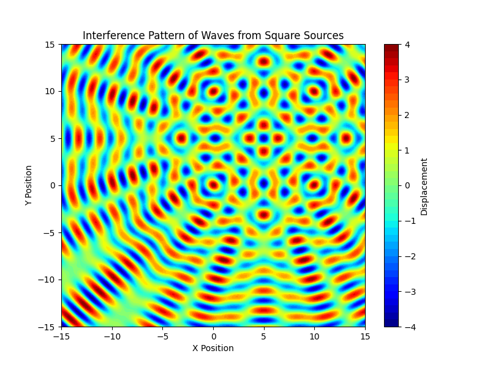

# Problem 1

To solve this problem, let's break it down into the key steps:

### 1. **Select a Regular Polygon**
   Choose a regular polygon for simplicity. For this case, we will start with a **square** (4 sides). This can later be generalized to other polygons like an equilateral triangle or pentagon.

### 2. **Position the Sources**
   The wave sources are placed at the vertices of the chosen polygon. For a square with side length \(a\), the vertices of the square are positioned at:

   - \( (0, 0) \)
   - \( (a, 0) \)
   - \( (a, a) \)
   - \( (0, a) \)

### 3. **Wave Equations**
   The wave emitted from each source is described by the following equation:

   \[
   \psi(r, t) = A \cdot \cos(k \cdot r - \omega \cdot t + \phi)
   \]

   where:
   - \( \psi(r, t) \) is the displacement of the water surface at point \(r\) (distance from the source) and time \(t\).
   - \( A \) is the amplitude of the wave.
   - \( k = \frac{2 \pi}{\lambda} \) is the wave number, related to the wavelength \( \lambda \).
   - \( \omega = 2 \pi f \) is the angular frequency, related to the frequency \(f\).
   - \( r \) is the distance from the source to the point on the surface.
   - \( \phi \) is the initial phase of the wave.

   For each point source at position \( (x_s, y_s) \), the wave equation becomes:

   \[
   \psi_s(r, t) = A \cdot \cos(k \cdot \sqrt{(x - x_s)^2 + (y - y_s)^2} - \omega \cdot t + \phi)
   \]

### 4. **Superposition of Waves**
   The principle of superposition tells us that the displacement at a point on the water surface due to multiple wave sources is the sum of the displacements from each individual source.

   If there are \(N\) sources located at the vertices of the polygon, the total displacement at a point \( (x, y) \) on the water surface is:

   \[
   \psi_{\text{total}}(x, y, t) = \sum_{i=1}^{N} \psi_i(x, y, t)
   \]

   Each term in the sum corresponds to the displacement from the wave source at vertex \(i\), and we use the wave equation for each source.

### 5. **Analysis of Interference Patterns**
   - **Constructive interference** occurs when the waves are in phase, leading to amplification of the wave at that point.
   - **Destructive interference** occurs when the waves are out of phase, leading to cancellation at that point.
   - We can observe regions of constructive and destructive interference by evaluating the total displacement \( \psi_{\text{total}}(x, y, t) \) across different points on the water surface.

### 6. **Visualization**
   We will use Python and Matplotlib to visualize the interference patterns. The water surface will be represented by a grid of points, and for each point, we will calculate the displacement \( \psi_{\text{total}}(x, y, t) \) as the sum of the contributions from the sources.

   #### Example Python Code Implementation:

### 7. **Interpretation of Results**
   - **Constructive interference** will be shown as areas where the displacement is large (high wave amplitude), typically in regions where the sources' waves meet in phase.
   - **Destructive interference** will be shown as areas where the displacement is small (or even zero), where the sources' waves cancel each other out.
   - By adjusting parameters such as the wavelength, frequency, and the number of sources, we can explore how the interference pattern changes.

### 8. **Deliverables**
   - **Python script**: The provided code can be used to simulate the wave interference pattern for different regular polygons by modifying the `sources` array.
   - **Markdown document**: The explanations of the problem, methodology, and results should be included, as well as a description of how to use the Python code.
   - **Graphical representations**: The plots generated by the Python code will visually depict the interference patterns.

### Conclusion:
   The interference pattern of waves emitted from point sources placed at the vertices of a regular polygon (such as a square) will exhibit regions of constructive and destructive interference. This pattern can be visualized and analyzed for different configurations, helping to understand the effects of wave superposition in such systems.

