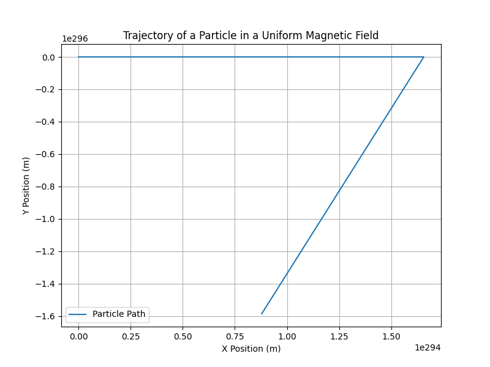

# Problem 1

### Simulating the Effects of the Lorentz Force

#### 1. Exploration of Applications

The Lorentz force describes the force experienced by a charged particle moving through an electric (\( \mathbf{E} \)) and magnetic (\( \mathbf{B} \)) field. This force is critical in various scientific and engineering fields, with numerous applications that rely on the interaction between charged particles and electromagnetic fields.

##### Key Systems where the Lorentz Force Plays a Key Role:

1. **Particle Accelerators (e.g., Cyclotrons, Synchrotrons)**:
   - Charged particles are accelerated to high speeds using electric fields. The magnetic fields control the trajectory of the particles, bending their path in a circular or spiral motion. The Lorentz force is what keeps the particles on track and allows them to gain energy as they circulate in the accelerator.
   
2. **Mass Spectrometers**:
   - The motion of charged particles (ions) in a magnetic field is used to measure their mass-to-charge ratio. The trajectory of ions in the magnetic field is influenced by the Lorentz force, allowing for the separation of different ions based on their velocity and mass.

3. **Plasma Confinement (e.g., Tokamaks)**:
   - In plasma confinement devices, such as Tokamaks or Stellarators, charged particles are contained within a magnetic field to prevent them from escaping. The Lorentz force is used to steer and stabilize the motion of plasma particles in order to achieve controlled nuclear fusion.

4. **Magnetic Traps (e.g., Penning Traps)**:
   - The Lorentz force is utilized to trap charged particles using electric and magnetic fields, which is fundamental in experiments involving the manipulation and study of ions or electrons.

##### Relevance of Electric and Magnetic Fields:
- The **magnetic field** \( \mathbf{B} \) governs the motion of charged particles by bending their path. The force exerted by a magnetic field is perpendicular to both the velocity of the particle and the magnetic field direction.
- The **electric field** \( \mathbf{E} \) can accelerate or decelerate particles, changing their velocity. The force exerted by an electric field acts in the direction of the field.

In combination, these fields influence the particle's motion, leading to phenomena such as circular or helical paths in uniform magnetic fields or drift motion in crossed electric and magnetic fields.

---

#### 2. Simulating Particle Motion

The Lorentz force equation can be written as:

\[
\mathbf{F} = q (\mathbf{E} + \mathbf{v} \times \mathbf{B})
\]

where:
- \( q \) is the charge of the particle,
- \( \mathbf{E} \) is the electric field,
- \( \mathbf{B} \) is the magnetic field,
- \( \mathbf{v} \) is the velocity of the particle.

For the simulation, we will solve this equation numerically, applying methods such as the **Euler** or **Runge-Kutta** method to update the position and velocity of the particle at each time step.

##### Scenarios to Simulate:
1. **Uniform Magnetic Field**: A particle in a uniform magnetic field will undergo circular motion. The radius of the circle is called the Larmor radius.
2. **Combined Electric and Magnetic Fields**: In this scenario, the particle will follow a helical path due to the combined forces of the electric and magnetic fields.
3. **Crossed Electric and Magnetic Fields**: The particle will exhibit drift motion, such as the **E × B drift**.

##### Image for Simulating the Motion:

#### 3. Parameter Exploration

By adjusting the following parameters, we can explore the effect on the particle's motion:
- **Magnetic Field Strength (\( B \))**: Stronger fields result in smaller circular paths (shorter Larmor radius).
- **Electric Field Strength (\( E \))**: Electric fields accelerate or decelerate the particle, changing its velocity and trajectory.
- **Initial Velocity (\( \mathbf{v}_0 \))**: The initial velocity affects the curvature of the trajectory. Higher velocities result in larger radii.
- **Charge and Mass (\( q, m \))**: The mass and charge of the particle influence its response to the forces. Lighter particles experience a greater deflection in the magnetic field.

We can vary these parameters and observe how they influence the particle's motion and trajectory.

---

#### 4. Visualization

The Python code above provides a 2D visualization of the particle’s trajectory in a uniform magnetic field. To observe phenomena like the **Larmor radius** and **drift velocity**, we can enhance the visualization by plotting in 3D or adding more complex field configurations.

- **Larmor Radius**: The radius of the circular motion of the particle in the magnetic field. It can be calculated using the formula:

\[
r_L = \frac{mv}{qB}
\]

- **Drift Velocity**: When electric and magnetic fields are crossed, the particle exhibits drift motion perpendicular to both fields. The drift velocity can be expressed as:

\[
v_d = \frac{E}{B}
\]

---

#### Deliverables:

1. **Markdown Document**: Contains an explanation of the Lorentz force, its applications, and the simulation.
2. **Python Script/Notebook**: Implements the simulation and visualization of the particle's trajectory under various field configurations.
3. **Visualizations**: Plots showing the particle's path in 2D (and optionally 3D) for different scenarios.
4. **Discussion**: An analysis of how the results relate to practical systems such as cyclotrons, Tokamaks, and mass spectrometers, with suggestions for extending the simulation to more complex scenarios, like non-uniform fields.

By varying the parameters, you can better understand the real-world applications of the Lorentz force, including the control of particles in accelerators, the separation of ions in mass spectrometers, and the confinement of plasma in fusion devices.
