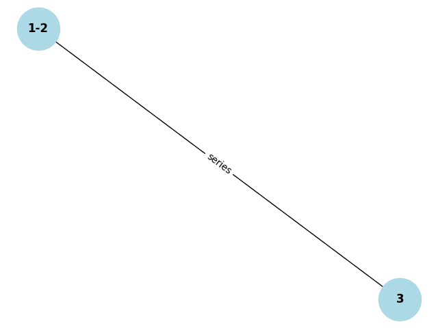

# Problem 1

### Option 1: Simplified Task – Algorithm Description

To calculate the equivalent resistance of a circuit represented by a graph, we can use graph theory principles. The basic idea is to simplify the graph by identifying series and parallel resistor connections and reducing them until a single equivalent resistance is obtained. Here's a breakdown of how we can approach this problem:

### Key Concepts

1. **Series Connection**: Resistors connected in series have the same current flowing through them, and their total resistance is the sum of their individual resistances.
   \[
   R_{\text{eq}} = R_1 + R_2 + ... + R_n
   \]

2. **Parallel Connection**: Resistors connected in parallel share the same voltage across them, and their total resistance is the reciprocal of the sum of the reciprocals of their individual resistances.
   \[
   \frac{1}{R_{\text{eq}}} = \frac{1}{R_1} + \frac{1}{R_2} + ... + \frac{1}{R_n}
   \]

3. **Graph Representation**: A resistor network can be represented as a graph, where nodes represent connection points, and edges represent resistors.

4. **Nested Connections**: Combinations of series and parallel resistors can occur in complex structures, so the algorithm needs to handle cases where simplifications must be performed repeatedly.

### Explanation

1. **Identifying Series Connections**: We begin by identifying series connections. This is done by finding edges in the graph that are connected in a single path. When we find them, we combine the resistors in that path by summing their individual resistances.

2. **Identifying Parallel Connections**: Next, we look for parallel connections. Parallel resistors are typically grouped together where multiple resistors connect to the same pair of nodes. These resistors are combined using the formula for parallel resistance.

3. **Iterative Reduction**: After simplifying series and parallel connections, we continue simplifying the graph until only one resistor remains. This iterative process handles nested combinations of resistors.

4. **Handling Nested Combinations**: The algorithm works recursively, simplifying the graph at each step. Nested combinations are automatically handled because the algorithm looks for connections at every step, ensuring that each simplification is processed.

### Option 2: Advanced Task – Full Implementation

In this option, you would implement the algorithm in a programming language (e.g., Python), leveraging a graph library like `networkx` to represent and manipulate the circuit graph.

Here’s an outline for how you might approach the implementation:

1. **Input Representation**: Represent the circuit as a graph, where nodes are the connection points and edges represent resistors with their resistance values.

2. **Simplifying the Graph**:
   - **Series Reduction**: Look for nodes that are connected in a straight line (series). Combine their resistances by summing them.
   - **Parallel Reduction**: Look for nodes that share a connection with multiple resistors (parallel). Combine their resistances by the reciprocal rule.
   
3. **Iterative Simplification**: Repeat the series and parallel reductions until only one resistor remains in the graph.

4. **Handle Nested Configurations**: Nested series and parallel configurations will naturally be simplified as the graph is reduced iteratively.

5. **Efficiency Considerations**: Since the algorithm may require multiple graph traversals, performance could become an issue with large circuits. Using efficient graph traversal techniques (e.g., depth-first search or breadth-first search) could improve the performance.

### Python Example with `networkx`

Here’s a simple implementation using Python and `networkx` to handle graph simplification:

### Testing the Implementation

You could test the implementation with examples like:
- Simple series and parallel combinations, e.g., two resistors in series, two resistors in parallel.
- Nested configurations, e.g., a series combination inside a parallel combination.
- Complex graphs with multiple cycles and interconnections, ensuring the algorithm reduces the graph correctly.

### Algorithm Efficiency

- **Time Complexity**: The time complexity mainly depends on how many times we need to traverse and simplify the graph. In the worst case, for each edge, we might need to check series or parallel connections, resulting in O(E) complexity for each traversal, where E is the number of edges.
- **Space Complexity**: The space complexity is mainly O(V + E), where V is the number of vertices (nodes) and E is the number of edges in the graph.

Potential improvements might include optimizing the detection of series and parallel connections to reduce redundant checks or using a more efficient data structure to represent the circuit.

