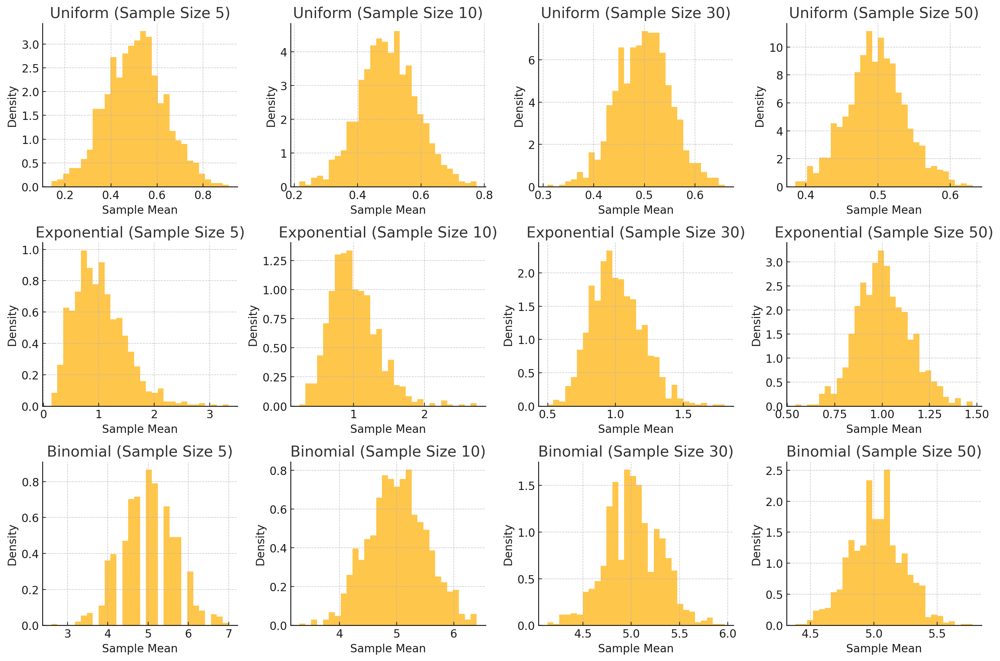

# Problem 1

# Simulating Sampling Distributions and Central Limit Theorem

## 1. Simulating Sampling Distributions

For this experiment, we will simulate three types of population distributions:

- **Uniform Distribution**: Every number within a specified range has an equal chance of being selected.
- **Exponential Distribution**: Describes the time between events in a Poisson process, characterized by a constant hazard rate.
- **Binomial Distribution**: Represents the number of successes in a fixed number of Bernoulli trials.

We will generate large datasets for each distribution to represent the population.

## 2. Sampling and Visualization

For each distribution, we will:
- Randomly sample from the population.
- Calculate the sample mean for different sample sizes (e.g., 5, 10, 30, 50).
- Repeat the sampling process multiple times (e.g., 1,000 times) to create a sampling distribution of the sample mean.

Histograms of the sample means will be plotted for each sample size, and we will observe how the distribution of sample means converges toward a normal distribution as the sample size increases.

## 3. Parameter Exploration

In this section, we will explore:
- **Shape of the Original Distribution**: How the original population distribution (uniform, exponential, binomial) influences the sampling distribution.
- **Sample Size**: Larger sample sizes should lead to sample means that more closely resemble a normal distribution.
- **Population Variance**: The spread of the sample means is influenced by the population's variance. A population with higher variance will result in sample means that spread out more.

## 4. Practical Applications

The **Central Limit Theorem** (CLT) has several important real-world applications:

- **Estimating Population Parameters**: Repeated sampling can help estimate population parameters like the population mean, even when the population distribution is not normal.
- **Quality Control in Manufacturing**: Sampling is used to monitor product quality, allowing manufacturers to detect deviations from expected values without testing every item.
- **Predicting Outcomes in Financial Models**: In finance, CLT helps to model aggregate outcomes (e.g., returns) over time, leading to normal approximations even if individual asset returns are not normally distributed.

## 4. Analysis of the Output:
- **Histograms for Uniform Distribution**: For small sample sizes, you may still see a skewed distribution. As the sample size increases, the sampling distribution of the sample means will converge toward normality.

- **Histograms for Exponential Distribution**: Since the original distribution is skewed, smaller sample sizes may show skewness. As the sample size increases, the sampling distribution of the mean becomes more normal.

- **Histograms for Binomial Distribution**: For smaller sample sizes, the distribution may appear more discrete, but as the sample size increases, the sample mean’s distribution will approximate normality.