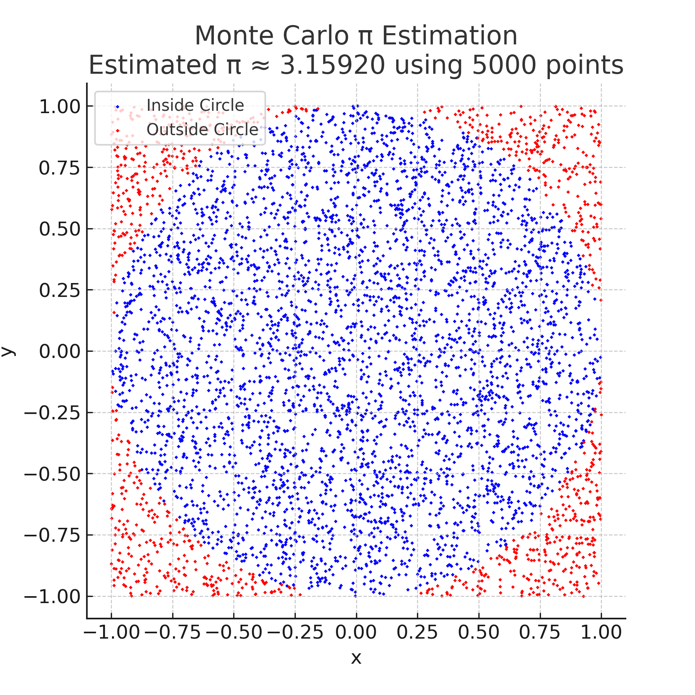

# Problem 2

# Estimating π Using a Circle

## 1. Theoretical Foundation:

When you randomly generate points uniformly inside a square that bounds a circle, the fraction of points that fall inside the circle approximates the ratio of the circle's area to the square's area.

For a unit circle (radius $r = 1$) inside a square with side length 2, the areas are:

- Circle area:  
  $$\pi \times 1^2 = \pi$$

- Square area:  
  $$2 \times 2 = 4$$


The probability that a randomly chosen point in the square lies inside the circle is:

$$
P = \frac{\text{Area of Circle}}{\text{Area of Square}} = \frac{\pi}{4}
$$

If you generate \(N\) points in the square, and \(N_{\text{inside}}\) points lie inside the circle, then:

$$
\frac{N_{\text{inside}}}{N} \approx \frac{\pi}{4}
$$

Rearranging gives an estimate for \(\pi\):

$$
\pi \approx 4 \times \frac{N_{\text{inside}}}{N}
$$

Thus, by counting the fraction of points inside the circle and multiplying by 4, you get an approximation of \(\pi\).

### Derivation of the Formula

$$
\pi = 4 \times \frac{N_{\text{inside}}}{N}
$$

for a Unit Circle


Consider a unit circle centered at the origin with radius \(r = 1\), and the square that bounds it with side length 2.

- **Area of the unit circle:**

$$
A_{\text{circle}} = \pi r^2 = \pi \times 1^2 = \pi
$$

- **Area of the bounding square:**

$$
A_{\text{square}} = (2r)^2 = 2^2 = 4
$$

If points are uniformly randomly generated within the square, the probability \(P\) that a point lies inside the circle is the ratio of the two areas:

$$
P = \frac{A_{\text{circle}}}{A_{\text{square}}} = \frac{\pi}{4}
$$

Suppose \(N\) points are generated and \(N_{\text{inside}}\) points fall inside the circle. The ratio of points inside the circle to total points approximates \(P\):

$$
\frac{N_{\text{inside}}}{N} \approx \frac{\pi}{4}
$$

Multiply both sides by 4 to isolate \(\pi\):

$$
\pi \approx 4 \times \frac{N_{\text{inside}}}{N}
$$

This formula allows us to estimate \(\pi\) by counting the fraction of points inside the circle.


## 2. Simulation:
1. Simulate the random dropping of a needle onto the plane. The angle at which the needle lands and the distance from the nearest line must be chosen randomly.
2. Count the number of times the needle crosses a line.
3. Use the formula to estimate π based on the number of crossings.

#### Objective:
Simulate random point generation within a square to estimate the value of π using the ratio of points that fall inside the inscribed circle.

#### Steps:
1. Generate random points $(x, y)$ such that:
   - $x \in [-1, 1]$
   - $y \in [-1, 1]$

   This represents a square bounding the unit circle.

2. Check if each point lies inside the circle:
   $$
   x^2 + y^2 \leq 1
   $$

3. Count points inside the circle and estimate π using:
   $$
   \pi \approx 4 \times \frac{\text{Number of points inside the circle}}{\text{Total number of points}}
   $$

#### Python Code:

```python
import random

def monte_carlo_pi(num_points=10000):
    inside_circle = 0

    for _ in range(num_points):
        x, y = random.uniform(-1, 1), random.uniform(-1, 1)
        if x**2 + y**2 <= 1:
            inside_circle += 1

    pi_estimate = 4 * inside_circle / num_points
    return pi_estimate

# Example usage
print("Estimated π:", monte_carlo_pi(10000))
```

## 3. Visualization:
Create a graphical representation of the simulation, showing the needle positions relative to the lines. This will help visualize how the needle placement and line crossings affect the estimate.



## 4. Analysis:
- Investigate how the accuracy of the estimate improves as the number of points increases.
- Discuss the convergence rate and computational considerations for this method.


### Accuracy Improvement with Increasing Points

As the number of random points \(N\) increases, the Monte Carlo estimate of \(\pi\) generally becomes more accurate. This happens because the **law of large numbers** ensures that the sample ratio (points inside circle vs. total points) converges to the true probability.

| Number of points | Estimated π | Error (\|Estimated - π\|) |
|------------------|-------------|---------------------------|
| 1,000            | ~3.14       | Moderate                  |
| 10,000           | ~3.141      | Smaller                   |
| 100,000          | ~3.1415     | Even smaller              |


### Convergence Rate

- The convergence rate of Monte Carlo methods is proportional to \( \frac{1}{\sqrt{N}} \), where \(N\) is the number of samples.
- This means **to improve accuracy by a factor of 10, you must increase the number of points by 100**.
- Monte Carlo methods are **slow to converge** compared to deterministic methods but are simple and versatile.

### Computational Considerations

- The algorithm is **embarrassingly parallel**: each point’s check is independent, making it easy to parallelize.
- Computational cost scales linearly with \(N\).
- For very large \(N\), memory and runtime increase, but with modern hardware and parallelization, millions of points can be handled efficiently.
- Monte Carlo is especially useful when other analytic or numeric integration methods become infeasible.
