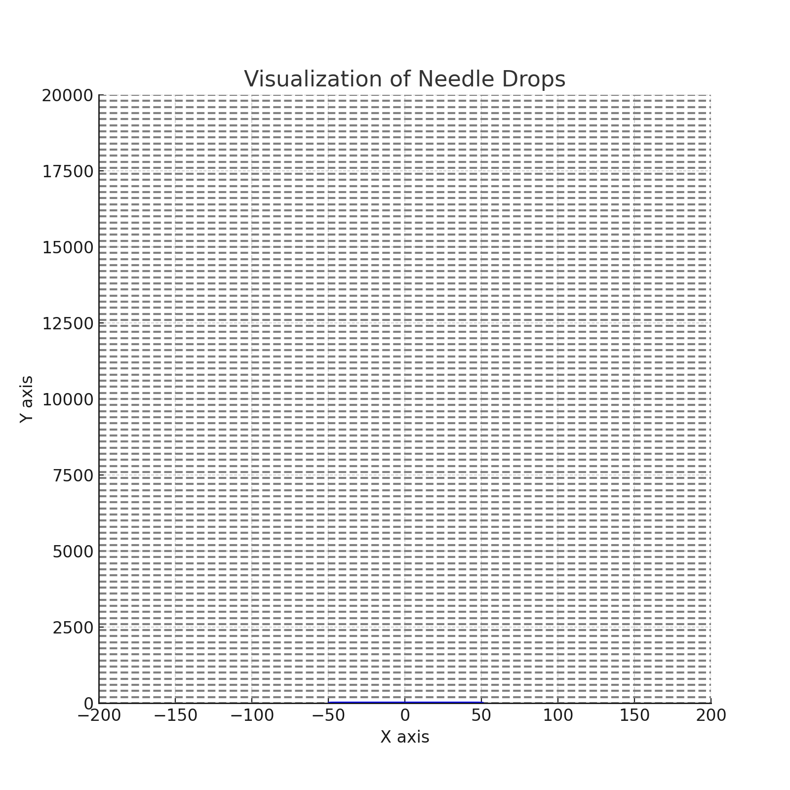

# Problem 2

# Estimating π Using a Circle

## 1. Theoretical Foundation:
The ratio of points inside a circle to the total number of points within a square can be used to estimate the value of π. To illustrate this, we consider a unit circle inscribed in a square with side length 2 (a square with vertices at (-1,-1), (1,-1), (1,1), and (-1,1)).

For a random point inside the square, the probability of that point lying inside the circle is the ratio of the area of the circle to the area of the square. 

- The area of the circle is π * r², and since the radius of the unit circle is 1, the area becomes π.
- The area of the square is 2 * 2 = 4.

Thus, the ratio of points inside the circle to the total number of points inside the square is approximately π/4.

### Formula Derivation:
For a unit circle (r = 1) inscribed in a square, the formula to estimate π is:

\[
\pi \approx 4 \times \frac{\text{Number of points inside the circle}}{\text{Total number of points in the square}}
\]

## 2. Simulation:
1. Generate random points within a 2D square (e.g., with coordinates between -1 and 1).
2. For each point, check whether it lies inside the unit circle using the equation \(x^2 + y^2 \leq 1\).
3. Estimate π by calculating the ratio of points inside the circle to the total number of points and multiplying by 4.

## 3. Visualization:
Create a plot to visualize the randomly generated points. Distinguish between points inside the circle (marked with one color) and points outside the circle (marked with another color).

## 4. Analysis:
- **Accuracy Improvement**: As the number of random points increases, the estimate of π will converge to the true value of π.
- **Convergence Rate**: The accuracy improves as the square root of the number of points, i.e., the error decreases by a factor of 1/√N, where N is the number of points.
- **Computational Considerations**: This method can be computationally expensive as the number of points grows, but it is simple to implement in simulations.

---

# Estimating π Using Buffon’s Needle

## 1. Theoretical Foundation:
Buffon’s Needle problem involves dropping a needle of length \(l\) onto a floor with parallel lines spaced a distance \(d\) apart. The probability that the needle crosses one of the lines can be used to estimate π.

The formula for estimating π is:

\[
\pi \approx \frac{2l}{d} \times \frac{1}{N} \times C
\]

Where:
- \(l\) is the length of the needle,
- \(d\) is the distance between the parallel lines,
- \(N\) is the number of needle drops,
- \(C\) is the number of times the needle crosses a line.

## 2. Simulation:
1. Simulate the random dropping of a needle onto the plane. The angle at which the needle lands and the distance from the nearest line must be chosen randomly.
2. Count the number of times the needle crosses a line.
3. Use the formula to estimate π based on the number of crossings.

## 3. Visualization:
Create a graphical representation of the simulation, showing the needle positions relative to the lines. This will help visualize how the needle placement and line crossings affect the estimate.

## 4. Analysis:
- **Effect of Needle Drops**: As the number of needle drops increases, the estimate of π will become more accurate.
- **Convergence Rate**: Similar to the circle-based approach, the accuracy improves as the number of trials increases, but the rate of convergence depends on the geometry and the randomness in the simulation.
- **Comparison with the Circle-Based Method**: Buffon’s Needle requires fewer random numbers to generate than the circle-based method for a comparable level of accuracy, but the convergence rate may be slower.
