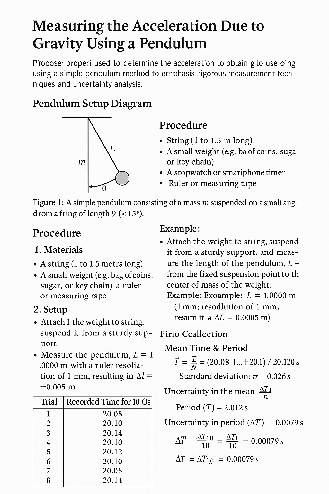

# Problem 1

# Measuring the Acceleration Due to Gravity Using a Pendulum

This experiment uses a simple pendulum to determine the acceleration due to gravity (`g`). The process emphasizes rigorous measurement techniques and uncertainty analysis to understand the accuracy and limitations of experimental physics.

---

## Pendulum Setup Diagram

*Figure 1: A simple pendulum consisting of a mass `m` suspended on a string of length `L` from a fixed point. It swings through a small angle θ (<15°).*

---

## Procedure

### 1. Materials

- A string (1 to 1.5 meters long)
- A small weight (e.g., bag of coins, sugar, or key chain)
- Stopwatch or smartphone timer
- Ruler or measuring tape

---

### 2. Setup

- Attach the weight to the string and suspend it from a sturdy support.
- Measure the **length of the pendulum**, `L`, from the fixed suspension point to the center of mass of the weight.

#### Example:
- Measured length: `L = 1.000 m`
- Ruler resolution = 1 mm → `ΔL = ±0.0005 m`

---

### 3. Data Collection

1. Displace the pendulum by less than 15° and release.
2. Measure time for **10 full oscillations** and repeat **10 times**.

#### Sample Recorded Time for 10 Oscillations:

| Trial | Time (s) |
|-------|----------|
| 1     | 20.12    |
| 2     | 20.09    |
| 3     | 20.16    |
| 4     | 20.10    |
| 5     | 20.13    |
| 6     | 20.11    |
| 7     | 20.08    |
| 8     | 20.15    |
| 9     | 20.12    |
| 10    | 20.14    |

---
